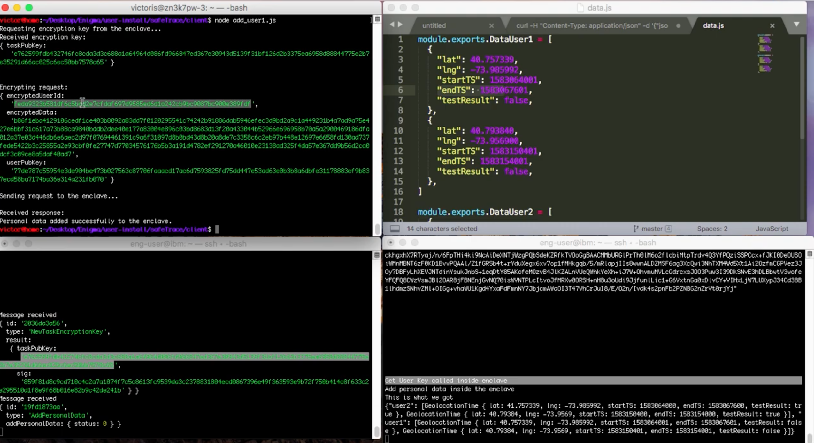

# Enclave for COVID-19 Self-reporting

This folder contains the code that runs inside the enclave using Intel Secure Guard Extensions (SGX). It builds on [Apache's Teaclave](https://github.com/apache/incubator-teaclave), and more specifically its [Rust SGX SDK](https://github.com/apache/incubator-teaclave-sgx-sdk) which is included as part of this repo as a submodule (branch = `v1.1.1-testing`).

## Demo

There is a [10min video demo](https://youtu.be/cyOuAMCQRlw) of Safetrace working end-to-end. As of the making of this demo, there is no UI, so everything is demoed through the console. Please note that the enclave is verbose from demoing purposes, but the production version will not output any secrets.




## Requirements

* SGX-capable computer host with SGX enabled in the BIOS
* Ubuntu Bionic (18.04) or newer
* [Rust](https://www.rust-lang.org/tools/install)

## Installation

1. Clone this repository, if you haven't already:

    * Using HTTPS:

    ```bash
    git clone https://github.com/enigmampc/covid-self-reporting.git
    ```

    * Using SSH:

	```bash
	git clone git@github.com:enigmampc/covid-self-reporting.git
	```

2. Install the SGX driver and SDK, as per the [INSTALL](INSTALL.md) instructions.


3. Move into the `enclave/safetrace` subfolder:

    ```bash
    cd enclave/safetrace
    ```

4. Compile the code:

    ```bash
    make
    ```

5. Run the enclave code:

    ```bash
    cd bin
    ./safetrace-app
    ```

## Future Work

This section documents some of the limitations of the current implementation, and covers some areas of future work.

* The amount of data that the enclave is capable of storing encrypted (through a process known as [sealing and unsealing](https://software.intel.com/en-us/blogs/2016/05/04/introduction-to-intel-sgx-sealing) is currently limited to 4kB. This is obviously not limited by disk space, but by the fact that the amount of data to seal/unseal needs to fit inside the enclave memory. Intel SGX documentation states that the enclave limit is 4GB, which should be tested for this particular application. The current limit is controlled by `SEAL_LOG_SIZE` in [enclave/src/data.rs] around Line 25. This value needs to at most equal to `HeapMaxSize` defined in [enclave/Enclave.config.xml]

* Enclave data is serialized for sealing/unsealing using JSON format, which is highly inefficient in terms of space. This should be improved using a binary format such as CBOR. The correct library `serde-cbor` that is SGX compatible should be identified and used, the code adjusted to use that. Data is JSON_serialized in [enclave/src/data.rs] in the first line of `create_sealeddata_for_serializable()`, and later deserialized in the last line of `recover_sealeddata_for_serializable()`.

* Error handling needs much improvement, as most functions inside the enclave will return success regardless of whether the fail or succeed. This obviously makes it hard to debug and troubleshoot. The developer team at Enigma is working on the right infrastructure for error handling with **enigmampc/EnigmaBlockchain**. Once that work is completed, it should be straightforward to be ported to this repo.

* Data is overwritten each time a user submits data - this can be improved but is hard. Currently user data is stored inside the enclave as a Rust [HashMap](https://doc.rust-lang.org/std/collections/struct.HashMap.html) indexed by the `userId` as its key, and the array of locations as its associated data. so everytime a new dataset is added to HashMap overwrites whatever prior entry was there for that key. Improving on this is hard because one would need to find data overlaps in terms of space and time with prior entries and do a proper merge.

* Data is not deleted after two weeks - this is easy to implement. This requires another end point that only the server would call on a daily basis (setup a cronjob) to delete old data. This endpoint would **not** be made available at the JSON RPC server so that could only be called internally.

* Document how to decode and interpred the Remote Attestation report. This is more of a task at the `client` end, but because all the information comes from SGX, it is included here.

* Sign code and deploy
